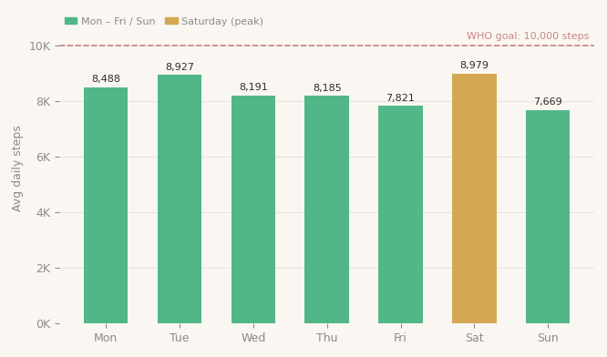
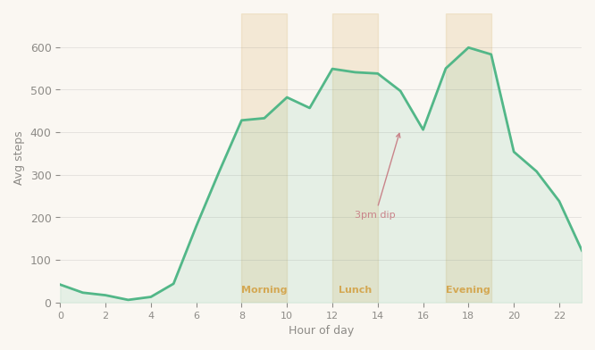
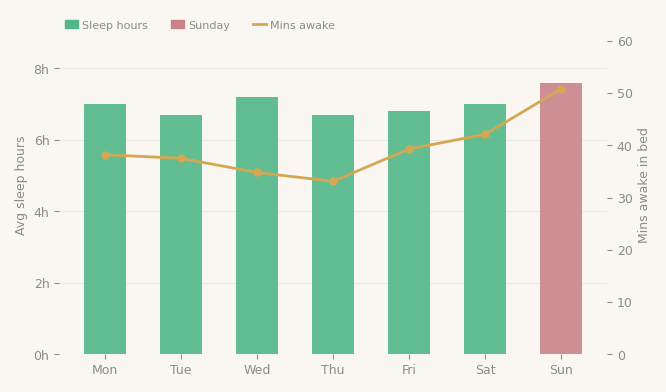
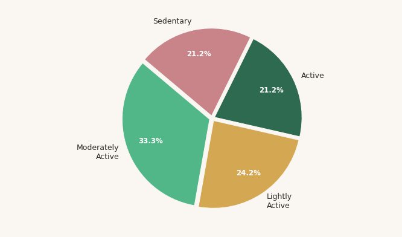
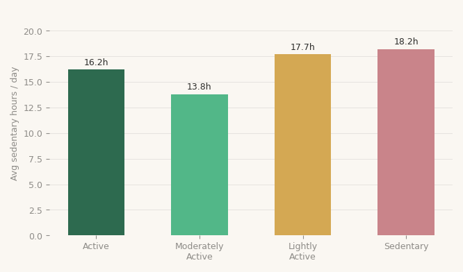
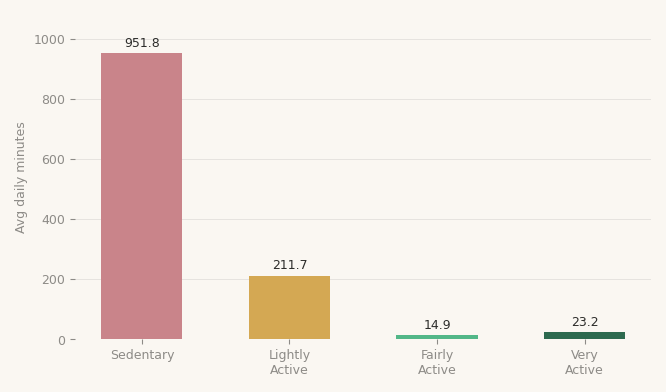

# Bellabeat Smart Device Analysis
### Google Data Analytics Professional Certificate — Capstone Project 2

**Analyst:** Peter Francis Muthukkalai  
**Dataset:** FitBit Fitness Tracker Data (Kaggle, CC0) — 33 users, April–May 2016  
**Tools:** BigQuery (SQL) · Tableau Public · Microsoft PowerPoint · Microsoft Word  
**Tableau Dashboard:** [View on Tableau Public](https://public.tableau.com/app/profile/peter.francis.muthukkalai/viz/Bellabeat_Analysis_17749098758380)

---

## Business Task

Analyse smart device usage data to understand how consumers use non-Bellabeat devices, then apply those insights to one Bellabeat product — the **Leaf wellness tracker** — to guide future marketing strategy.

**Key question:** How do FitBit users engage with their device, and what does that mean for Bellabeat?

---

## Key Findings

| Metric | Finding | Implication |
|--------|---------|-------------|
| Avg daily steps | 8,329 steps/day | 17% below WHO 10,000 goal |
| Sedentary time | 15.9 hrs/day | Affects every activity segment |
| Average sleep | 7.0 hrs/night | At minimum recommended threshold |
| Sleep quality | 39 mins awake/night | Poor wind-down routines |
| Peak activity day | Saturday (8,979 steps) | Leisure-driven, not habitual |
| Peak activity hour | 6pm (599 avg steps/hr) | Post-work exercise window |
| 3pm activity dip | Hour 15 — lowest daytime | Optimal reminder trigger point |
| Sunday sleep paradox | Most time in bed, worst quality | Anticipatory work-week stress |
| Weight tracking | 8 of 33 users (24%) | Low engagement with health metrics |

---

## Analysis Charts

### Activity by Day of Week

Saturday is the most active day (8,979 avg steps). Sunday and Friday are lowest. Monday has the highest sedentary time (16.4 hrs) — a work-week onset effect.

### Hourly Activity Patterns

Three clear peaks: morning (8–10am), lunch (12–2pm), and evening (5–7pm). A consistent 3pm dip to 406 avg steps — the optimal window for a Leaf movement reminder.

### Sleep Quality by Day

Users average 7.0 hrs sleep but lie awake 39 mins/night. The **Sunday paradox**: most time in bed (8.4 hrs) but worst sleep quality (50.8 mins awake) — anticipatory work-week stress.

### User Activity Segments

Four segments: Active (21.2%), Moderately Active (33.3%), Lightly Active (24.2%), Sedentary (21.2%). Moderately Active is the largest group and closest to the Active threshold — highest conversion priority.

### Sedentary Hours by Segment

Even Active users average 16.2 sedentary hrs/day. Sedentary users average 18.2 hrs. High step counts don't prevent prolonged inactivity.

### Active Minutes Breakdown

Sedentary time dominates at 951.8 min/day (66% of the day). Very Active minutes: only 23.2/day — users are close to but don't consistently hit the 20–30 min vigorous exercise recommendation.

---

## Top 3 Recommendations for Bellabeat Leaf

**01 — Smart Movement Reminders (Highest Priority)**  
Activity dips at 3pm daily and spikes in Monday sedentary hours. The Leaf should send a haptic reminder at 3pm and a Monday morning step challenge. Goals personalised per activity segment.

**02 — Sunday Wind-Down Programme**  
Target the Sunday paradox directly. The Leaf delivers a guided wind-down sequence on Sunday evenings. App tracks pre-sleep restlessness and offers breathing exercises to reduce the 50.8-min awake time.

**03 — Personalised Goals by Activity Segment**  
Moderately Active users (33.3%) sit closest to the Active threshold. Onboarding classifies users by segment and assigns progressive weekly step targets with in-app coaching to drive conversion.

---

## Data Cleaning Summary

| Issue | Action | Rows Affected |
|-------|--------|---------------|
| Duplicates in sleep_day | Removed with ROW_NUMBER() | 413 → 410 rows |
| Invalid days (0 steps, 1440 min sedentary) | Removed — device not worn | 940 → 856 rows |
| Fat column nulls in weight_log | Excluded (97% null) | — |
| Mixed date formats in hourly tables | Standardised with CASE/PARSE_TIMESTAMP | — |
| Sedentary mins include sleep | Documented — comparisons made relatively | — |

All cleaning performed in BigQuery SQL.

---

## Repository Structure

```
bellabeat-smart-device-analysis/
├── Bellabeat_Analysis_Peter_Francis.pptx   # 14-slide executive presentation
├── Bellabeat_Report_Peter_Francis.docx     # Full analytical report (9 pages)
├── charts/
│   ├── chart1_steps_day.png
│   ├── chart2_steps_hour.png
│   ├── chart3_sleep_day.png
│   ├── chart4_user_segments.png
│   ├── chart5_sedentary_segment.png
│   └── chart6_active_minutes.png
└── README.md
```

---

*Part of the Google Data Analytics Professional Certificate portfolio.*  
*Case Study 1: [Cyclistic Bike-Share Analysis](https://github.com/fishy08/Cyclistic-bike-share-analysis)*
